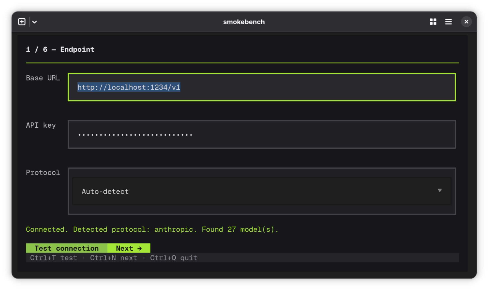
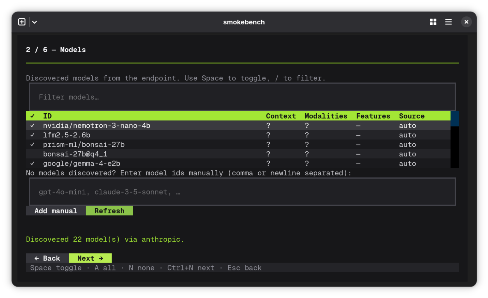
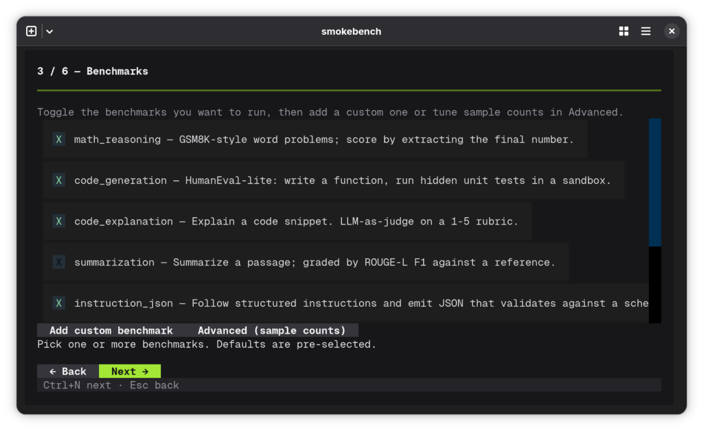
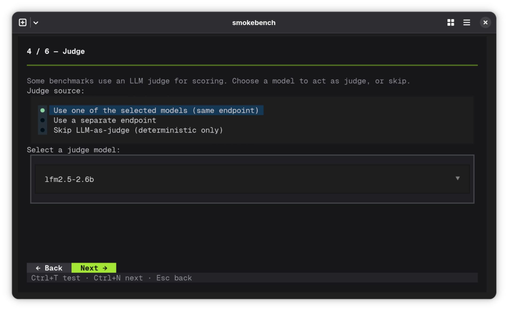
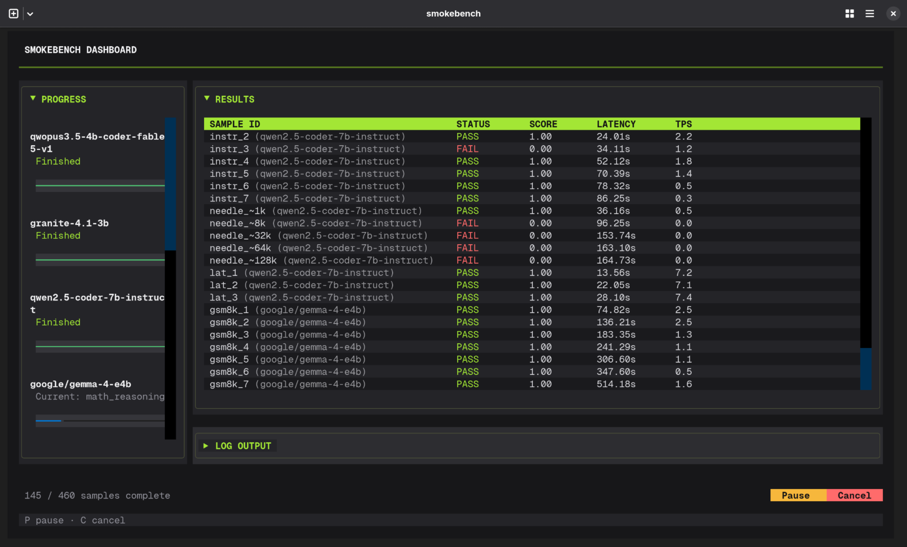

<div align="center">

# 💨 smokebench

**Rapid, interactive TUI smoke tests for OpenAI- and Anthropic-compatible LLM endpoints.**

Measure response quality, schema compliance, token throughput, and more on *your* hardware before committing to long runs.

[](https://pypi.org/project/smokebench)
[](https://www.python.org/downloads/)
[](LICENSE)
[](https://textual.textualize.io/)

[Why smokebench](#why-smokebench) • [Quick Start](#quick-start) • [TUI Walkthrough](#tui-walkthrough) • [Built-in Benchmarks](#built-in-benchmarks-8) • [Development/Contribution](#contributing)

</div>

---

## Why smokebench?

Online leaderboards test LLMs on enterprise GPU clusters running unquantized weights. They don't tell you how a 4-bit quant actually performs on your machine, under your system load, against your specific schema constraints.

Heavy LLM evaluation frameworks (`lm-eval-harness`, `Promptfoo`) are great for research or CI/CD pipelines, but take heavy setup time and long runs.

**`smokebench`** fills a different niche: zero-config terminal UI designed for **rapid, interactive smoke tests** while iterating on prompts, models, or endpoints.

### Key Features:
- 🎯 **TUI-first, not CLI-first:** Configure endpoints, select models, toggle benchmarks, and set judge options visually with keyboard shortcuts. No YAML files to edit by hand for a quick check.
- 🔌 **Multi-protocol:** Direct support for OpenAI and Anthropic API schemas out of the box (works with Ollama, vLLM, LM Studio, SGLang, or cloud proxies).
- 🧪 **8 built-in benchmarks:** math, code, summarization, JSON mode, long context, creative writing, streaming throughput — enough to surface regressions in minutes.
- 🏆 **Recommendation chips:** after a run, the Results screen highlights which model won for coding, reasoning, cost*, or speed.
- 📊 **Exportable artifacts:** Auto-generates clean Markdown reports and structured JSON logs for tracking runs over time.
- 🪶 **Lightweight:** Python 3.11+, a handful of pip packages, no database, no Kubernetes, no platform account.

> *If you need rigorous leaderboards with thousands of samples, use something else.*
> <br>*If you want to quickly check "is this tiny model smart enough?" or "did my fine-tune improve?", this is the tool.*

---


## Requirements

- **Python 3.11+**
- Core: `httpx`, `textual`, `pydantic`, `pyyaml`, `jsonschema`, `rich`
- Optional: `tiktoken`, `rouge-score` (auto-fallback if missing)

## Quick Start

### Installation

Install via `pip` or `uv`:

```bash
# Using pip
pip install smokebench

# Using uv
uv tool install smokebench
```

---

## TUI Walkthrough

```
┌─────────────┐     ┌─────────────┐     ┌─────────────┐     ┌─────────────┐
│ 1. Endpoint │ ──> │  2. Models  │ ──> │3. Benchmarks│ ──> │  4. Judge   │
└─────────────┘     └─────────────┘     └─────────────┘     └─────────────┘
                                                                   │
      ┌─────────────┐                   ┌─────────────┐            │
      │ 6. Results  │ <──────────────── │   5. Run    │ <──────────┘
      └─────────────┘                   └─────────────┘
```

| Screen | Purpose | Keys |
|--------|---------|------|
| **1. Endpoint** | Base URL, API key, protocol (auto/openai/anthropic) | `Ctrl+T` test, `Ctrl+N` next |
| **2. Models** | Auto-fetched list with context/modalities/features; multi-select | `Space` toggle, `A` all, `N` none, `/` filter |
| **3. Benchmarks** | Toggle 8 built-in tasks; add custom YAML; "Advanced" for per-task sample counts | `Ctrl+N` next |
| **4. Judge** | Pick judge model: from selected / separate endpoint / skip | `Ctrl+N` next |
| **5. Run** | Live progress bars + streaming log; pause/resume/cancel | `P` pause, `C` cancel |
| **6. Results** | Sortable table + recommendation chips; export JSON/MD | `E` export, `Esc` new run |

---

## Screenshots

**Endpoint Configuration**

**Model Selection**

**Benchmark Toggle**

**Judge Configuration**

**Run Progress**


---

## Built-in Benchmarks (8)

| Task | Samples | Grader | Measures |
|------|---------|--------|----------|
| **Math / Reasoning** (GSM8K-lite) | 20 | Numeric regex | Accuracy |
| **Code Generation** (HumanEval-lite) | 15 | Sandboxed subprocess exec | Pass@1 |
| **Code Explanation** | 10 | LLM-judge rubric 1–5 | Quality |
| **Summarization** | 10 | ROUGE-L F1 | Fidelity |
| **Instruction / JSON Mode** | 12 | JSON Schema validation | Schema compliance |
| **Long Context** (Needle-in-haystack) | 5 sizes (1k–128k) | Exact substring | Effective context |
| **Creative Writing** | 8 | LLM-judge rubric 1–5 | Style & Prompt Following |
| **Latency / Throughput** | 10 | Streaming metrics | TTFT, tokens/sec (p50/p95) |

---

## Custom Benchmarks

Extend `smokebench` by loading custom YAML definitions directly inside the UI (**Benchmarks > Add custom benchmark**):

```yaml
name: my_custom_task
description: "Extract structured data"
samples:
  - id: sample_01
    prompt: "Parse: 'John, 30, NYC' --> JSON with name, age, city"
    grader: json_schema
    schema:
      type: object
      properties:
        name: {type: string}
        age: {type: integer}
        city: {type: string}
      required: [name, age, city]
```

---

## Recommendations Engine

After a run, the **Results** screen shows chips for:

- **`best_overall`** - mean pass-rate across deterministic tasks
- **`best_coding`** - `code_gen` + `code_explain`
- **`best_reasoning`** - `math` + `instruction_json`
- **`best_long_context`** - needle retrieval at max tested size
- **`best_json_mode`** - `instruction_json` pass-rate
- **`best_writing`** - `creative_writing` + `code_explain` (judge score)
- **`fastest`** - median tokens/sec (latency task)
- **`cheapest`** - lowest USD cost (requires pricing config)

*Tie-breakers automatically prioritize lower latency, then lower cost.*

---

## Pricing (Optional)

Add per-model pricing in `smokebench.yaml` (auto-created in the project directory):

```yaml
pricing:
  entries:
    gpt-4o:
      input_per_million: 5.0
      output_per_million: 15.0
    gpt-4o-mini:
      input_per_million: 0.15
      output_per_million: 0.60
```

---

## Output Artifacts

Each run creates `./smokebench_results/run_YYYYMMDD_HHMMSS/`:

```
run_20260719_143022/
├── summary.json      # models, tasks, errors
├── details.json      # per-task per-model scores
├── samples.jsonl     # Full input/output logs per sample (streamable)
├── report.md         # human-readable markdown summary
```

---

## Contributing

Feel free to open issues or PRs!

To set up for local development:

```bash
# Clone the repository
git clone https://github.com/Ninja-5000/smokebench.git
cd smokebench

# Create virtual env and install dependencies
make venv
source .venv/bin/activate

# Run test suite
make test

# Launch dev version
make run
```

---

## License

Distributed under the [MIT License](LICENSE)
